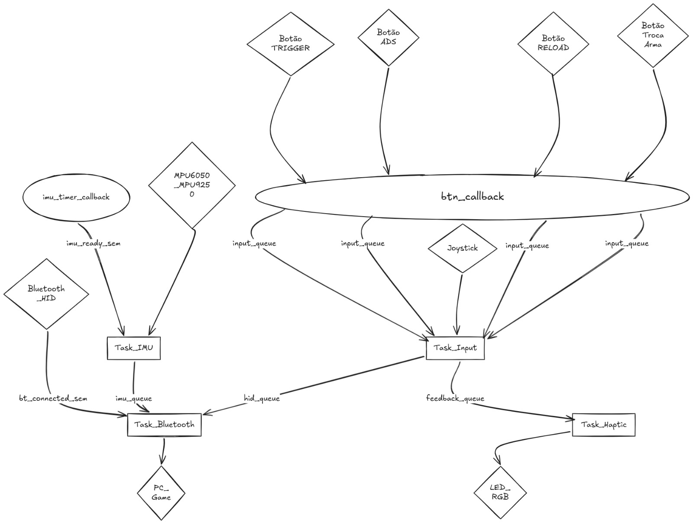
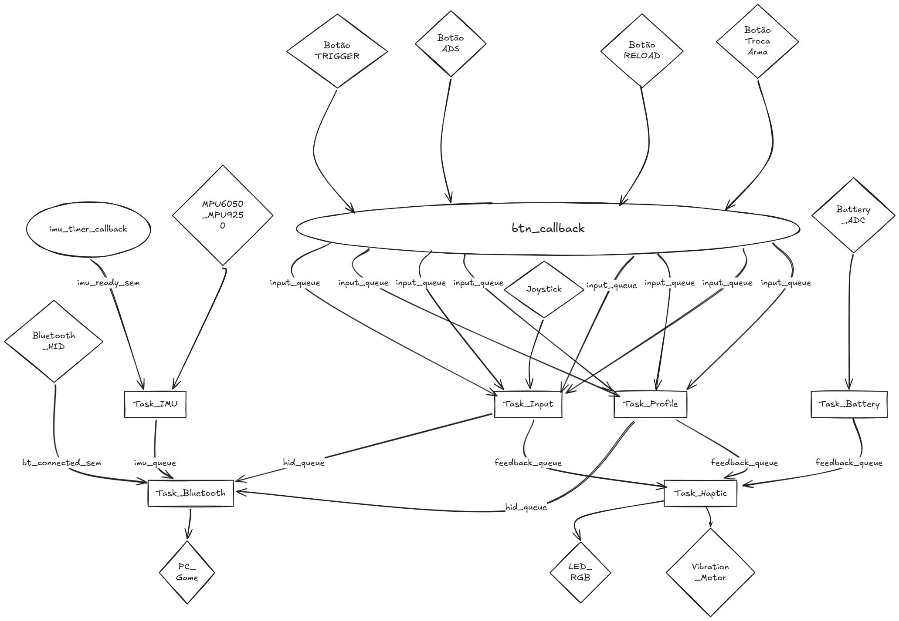

# README — APS Embarcados

## Projeto: **Astra Controller**

### Controle FPS Imersivo com IMU + Bluetooth HID

---

#  Jogo

O controle foi desenvolvido para jogos FPS competitivos, principalmente:

* Counter-Strike 2
* Valorant

A proposta é substituir parcialmente mouse e teclado por um controle físico imersivo em formato de arma futurista/tática, permitindo movimentação, mira e ações do jogo através de sensores físicos e interação em tempo real.

---

#  Ideia do Controle

O projeto consiste em um controle wireless Bluetooth HID em formato de arma sci-fi inspirado em FPS modernos.

O sistema utiliza uma IMU (acelerômetro + giroscópio) para converter os movimentos físicos da arma em movimentação da câmera do jogo.

## Funcionamento da mira

* Inclinar para direita/esquerda → movimenta visão horizontal
* Inclinar para cima/baixo → movimenta visão vertical

Além da IMU, o controle possui:

| Componente         | Função                     |
| ------------------ | -------------------------- |
| Joystick analógico | Movimentação do personagem |
| Trigger mecânico   | Disparo                    |
| Botão ADS          | Mira                       |
| Botão lateral      | Troca de arma              |
| Botão auxiliar     | Recarregar/interações      |
| LEDs RGB           | Status do sistema          |
| Motor de vibração  | Feedback háptico           |
| Bateria integrada  | Alimentação portátil       |

---

#  Objetivos do Projeto

* Criar um controle jogável com baixa latência
* Aplicar RTOS em sistema embarcado
* Utilizar Bluetooth HID
* Integrar sensores e atuadores em tempo real
* Desenvolver estrutura modular utilizando tasks, filas e interrupções
* Criar experiência imersiva para FPS

---

#  Arquitetura do Sistema

## Hardware Principal

| Componente       | 
| ---------------- | 
| Microcontrolador | 
| IMU              | 
| Joystick         | 
| LEDs RGB         | 
| Vibração         | 
| Comunicação      | 
| Alimentação      | 
| Carregamento     | 
| Conversor        | 

---

#  Inputs e Outputs

## Inputs

| Tipo      | Quantidade | Descrição                 |
| --------- | ---------- | ------------------------- |
| Analógico | 2          | Eixos do joystick         |
| IMU       | 1          | Acelerômetro + giroscópio |
| Digital   | 4+         | Trigger e botões          |

### Entradas digitais

* Trigger
* ADS
* Troca de arma
* Recarregar/interagir
* Botão de perfil (extra)
* Botão macro (extra)

Todas as entradas digitais utilizam interrupções/callbacks.

---

## Outputs

| Tipo                 | Descrição          |
| -------------------- | ------------------ |
| LED RGB              | Status e efeitos   |
| Vibração             | Feedback háptico   |
| Bluetooth HID        | Comunicação com PC |
| Indicador de bateria | LEDs/status        |

---

#  Protocolo Utilizado

## Bluetooth HID

O controle utiliza Bluetooth HID para ser reconhecido pelo computador como dispositivo de entrada.

### Dados enviados

* Movimento da IMU → mouse/mira
* Joystick → WASD
* Trigger → clique esquerdo
* ADS → clique direito
* Botões → teclas auxiliares

---

#  Estrutura RTOS

O firmware será estruturado utilizando FreeRTOS.

## Tasks do sistema

| Task           | Responsabilidade         |
| -------------- | ------------------------ |
| Task_IMU       | Leitura da IMU           |
| Task_Input     | Processamento de botões  |
| Task_Bluetooth | Envio HID                |
| Task_Haptic    | Vibração e LEDs          |
| Task_Battery   | Monitoramento da bateria |
| Task_Profile   | Perfis e macros          |

---

#  Comunicação interna

## Filas (Queues)

| Queue          | Função            |
| -------------- | ----------------- |
| imu_queue      | Dados da IMU      |
| input_queue    | Eventos de botões |
| hid_queue      | Pacotes HID       |
| feedback_queue | Vibração/LEDs     |

---

## Semáforos

| Semáforo         | Função           |
| ---------------- | ---------------- |
| bt_connected_sem | Estado Bluetooth |
| imu_ready_sem    | Nova leitura IMU |

---

#  Interrupções (ISR)

| ISR              | Evento        |
| ---------------- | ------------- |
| GPIO_ISR_TRIGGER | Trigger       |
| GPIO_ISR_ADS     | ADS           |
| GPIO_ISR_RELOAD  | Recarregar    |
| GPIO_ISR_SWAP    | Troca de arma |

Todas as entradas digitais operam por interrupção.

---

#  Diagrama de Blocos do Firmware

```
```


---

---

#  Perfis de Usuário

O controle possuirá múltiplos perfis:

| Perfil      | Característica      |
| ----------- | ------------------- |
| Precision   | baixa sensibilidade |
| Competitive | média sensibilidade |
| Aggressive  | alta sensibilidade  |

Troca realizada via combinação de botões.


---

#  Feedback Háptico

Eventos do controle gerarão feedback tátil:

| Evento          | Feedback          |
| --------------- | ----------------- |
| Conectado       | vibração curta    |
| Disparo         | recoil            |
| Troca de perfil | padrão RGB        |
| Bateria fraca   | alerta vibratório |

---

#  Expert Escolhido

## RTOS + Bluetooth

O projeto combina:

* gerenciamento multitarefa via FreeRTOS;
* comunicação Bluetooth HID em tempo real.

### Justificativa técnica

A separação em tasks reduz latência, melhora modularidade e garante resposta rápida aos inputs críticos do jogo.

---

#  Projeto Mecânico

## Conceito

Carcaça sci-fi/tática inspirada em:

* Valorant
* Counter-Strike
* Cyberpunk
* armas futuristas compactas

## Estrutura

* impressão 3D;
* suporte interno para PCB;
* compartimento de bateria;
* trigger mecânico;
* LEDs embutidos.

---

#  Imagens do Controle

## Proposta inicial

*fazemos depois*

## Protótipo real

*fazemos depois*
---

#  Organização do Firmware

```text
/src
    main.c
    imu.c
    bluetooth.c
    input.c
    haptic.c
    battery.c
    profiles.c

/include
    imu.h
    bluetooth.h
    input.h

/docs
    imagens
    esquematicos
```

#  Integrantes

* Matheus Amorim
* Matheus Braido

---
